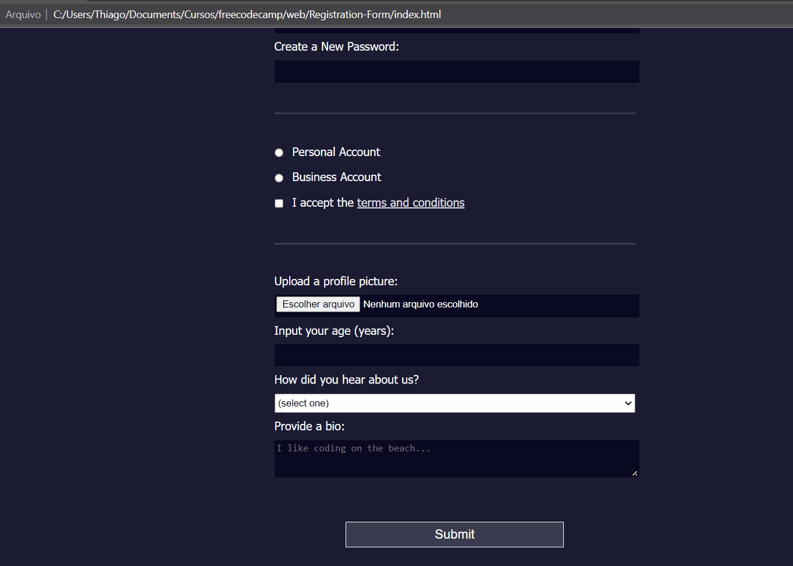

# Projeto - Registration Form 📋📇📝

Formulário desenvolvido para exercitar a escrita de HTML para formulários. O código foi escrito durante um módulo do curso de Web Design Responsivo - freeCodeCamp.org. 😎.

## Tecnologias

- HTML
- CSS

[]
